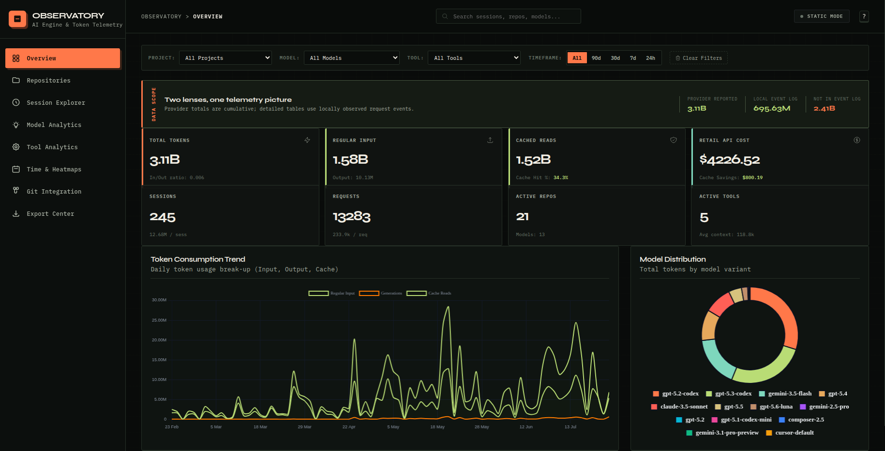
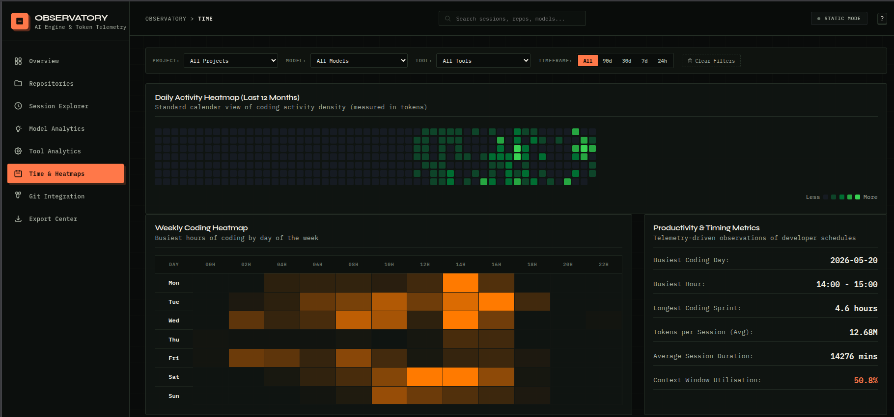

# TokStat — AI Engineering Observatory & Token Tracker

[](https://opensource.org/licenses/MIT)
[](https://www.python.org/downloads/)

**TokStat is a local-first, self-contained observatory that tracks your AI developer token usage — calculated on your machine, by your machine.**

It collects telemetry directly from the AI tools you run (Claude Code, Gemini
Antigravity, Aider, Copilot, Cursor/VS Code via the ingestion endpoint), stores
it in its own database (`~/.tokstat/telemetry.db`, WAL mode), and renders a
rich interactive dashboard. **No external daemons required.** Legacy
[OpenUsage](https://github.com/janekbaraniewski/openusage) and
[tokentop](https://github.com/tokentopapp/tokentop) databases are optional
augmentary sources that TokStat imports read-only — never a dependency.

## Dashboard Preview




## Features

- **Autonomous collection** — embedded scrapers poll local tool data
  (Claude Code JSONL transcripts, Aider model stats, Gemini brain logs,
  Copilot session store) and an HTTP ingestion server (`/v1/events`) accepts
  events from IDE extensions, shell wrappers and proxies.
- **Native storage** — `~/.tokstat/telemetry.db` (SQLite, WAL mode) with an
  OpenUsage-compatible schema; time-window fingerprint dedup keeps events
  merge-safe across sources.
- **Zero-loss migration** — `tokstat migrate` imports existing OpenUsage and
  tokentop history read-only (originals untouched).
- **Honest numbers** — events are flagged `ok` (real usage) or `estimated`
  (deterministic estimates from content length — never fabricated).
- **Interactive dashboard** — self-contained HTML with Chart.js, model/tool
  filtering, git-commit correlation, heatmaps and keyboard shortcuts.
- **Native daemon** — `tokstat daemon start|stop|status` runs collectors +
  ingestion server in the background; `--watch` gives live browser updates.
- **Exports** — PDF, JSON, Markdown and CSV reports.

## Installation

The PyPI distribution is named **`tokstat-observatory`** (the console command
remains `tokstat`).

```bash
pip install tokstat-observatory        # or: uv tool install tokstat-observatory
```

From source:

```bash
git clone https://github.com/sanjeevafk/tokstat.git
cd tokstat
uv pip install -e ".[dev]"   # or: make dev
```

## Quick Start

**One command does everything.** Running `tokstat` (or `make run`) gathers
fresh usage from every local source, generates the dashboard and opens it in
your browser:

```bash
tokstat
```

Under the hood the bare command runs an idempotent pipeline:

1. **Migrate** — optional read-only import of existing OpenUsage/tokentop
   history (skipped once already imported).
2. **Collect** — gather telemetry from all local sources (Claude Code JSONL,
   Gemini Antigravity brain logs, Aider stats, Copilot store, Cursor,
   legacy OpenUsage/tokentop sync).
3. **Render** — write `tokstat_dashboard.html` and open it.

Flags for fine control:

```bash
tokstat --no-collect   # render only, skip the gathering step
tokstat --no-open     # don't auto-open the browser
```

More granular commands:

```bash
# Collect telemetry once from all local sources.
tokstat collect --once

# (Optional) Import existing OpenUsage / tokentop history - read-only.
tokstat migrate

# Run the background daemon: collectors + ingestion server.
tokstat daemon start
tokstat daemon status
tokstat daemon stop

# Live watch mode with browser updates:
tokstat --watch --port 5000

# Structured exports:
tokstat --export ./reports
```

Common workflows via `make` (`make help` lists all targets):

```bash
make run             # same as `tokstat` - gather + render + open
make test            # run the test suite
make lint            # ruff check
make check           # lint + test (CI gate)
make build           # sdist + wheel into dist/
make release-check   # build + twine check
```

### Supported data sources

| Source | Token data | Flags |
| :--- | :--- | :--- |
| Claude Code (`~/.claude/projects/*.jsonl`) | Real (`message.usage`) | `ok` |
| Aider (`.aider.model.stats.json`) | Real | `ok` |
| Gemini Antigravity (brain `overview.txt`) | Estimated (content length) | `estimated` |
| GitHub Copilot (`~/.copilot/session-store.db`) | Estimated (char-length heuristic) | `estimated` |
| Cursor / VS Code (`state.vscdb`) | Usually none exposed | — use ingestion endpoint |
| Custom hooks / proxies | Real | `POST /v1/events` |
| OpenUsage / tokentop DBs (optional) | Imported history + balance snapshots | read-only |

The dashboard marks estimated events so you always know which numbers are
measurements and which are approximations.

### Self-reliant vs. augmentary mode

By default TokStat syncs OpenUsage/tokentop databases **if they exist**
(augmentary: richer data, including all-time provider totals). Set
`TOKSTAT_SYNC_LEGACY=0` for pure self-reliant mode:

```bash
TOKSTAT_SYNC_LEGACY=0 tokstat
```

`tokstat migrate` is an explicit command and always imports, regardless of the
flag.

## Privacy

- **Everything stays on your machine.** TokStat reads local tool data, stores
  it in `~/.tokstat/`, and serves dashboards on `127.0.0.1` only.
- Nothing is uploaded. The ingestion server binds localhost by design.
- Optional future provider polling would require *your* API keys and never
  happens implicitly.

## Python API

```python
from tokstat import analytics, exporter, renderer

data = analytics.compute_analytics()
renderer.generate_html_report(data, "dashboard.html")
exporter.export_json(data, "report.json")
```

## Project Structure

```
tokstat/
├── src/tokstat/
│   ├── cli.py             # CLI entrypoint (tokstat command)
│   ├── config.py          # Centralized paths, env switches, WAL connections
│   ├── migration.py       # Native schema + read-only legacy import
│   ├── server.py          # HTTP ingestion server (/v1/events, /health)
│   ├── daemon.py          # Background daemon (collectors + ingestion)
│   ├── collectors/        # Embedded scrapers (claude_code, aider, gemini,
│   │                      #  copilot, cursor, legacy_sync)
│   ├── db_access.py       # Native DB reads (queries, balance observations)
│   ├── queries.py         # Optimized SQL telemetry queries
│   ├── analytics.py       # Analytical calculations & git correlation
│   ├── renderer.py        # HTML dashboard generator
│   ├── exporter.py        # PDF / CSV / JSON / Markdown exporters
│   └── utils.py           # Cost estimation & git metadata utils
├── tests/                 # Unit and integration test suite
├── docs/                  # Architecture + implementation plan
├── pyproject.toml         # Hatchling build (dist: tokstat-observatory)
├── Makefile               # Dev/build/release workflows (make help)
├── ACKNOWLEDGEMENTS.md    # Schema/wire-format credits
└── LICENSE                # MIT License
```

## Documentation

- [Architecture & technical reference](docs/observatory_architecture.md)

## License

Distributed under the MIT License. See [LICENSE](LICENSE) for details.
