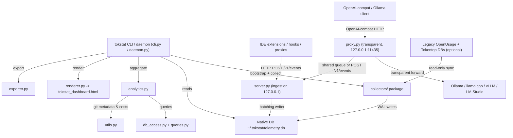

# TokStat - Architecture & Technical Reference

This document describes the modular architecture of **TokStat** (AI Engineering
Telemetry Observatory & Token Tracker). It outlines the system topology,
multi-source telemetry data pipelines, reconciliation logic, interactive
visualization design, and CLI operations.

TokStat is **self-contained**: it collects telemetry itself via embedded
scrapers and an HTTP ingestion server, stores everything in its own native
database (`~/.tokstat/telemetry.db`), and works with zero external daemons.
Legacy OpenUsage / tokentop databases are optional augmentary sources imported
read-only.

---

## 1. System Topology & Component Architecture



### Module Reference Matrix

| Module | Location | Primary Responsibility |
| :--- | :--- | :--- |
| **`cli.py`** | [`src/tokstat/cli.py`](../src/tokstat/cli.py) | Main CLI entry point (`tokstat`): dashboard generation, `--watch` live-sync, `--export`, plus `migrate`, `collect --once`, and `daemon start\|stop\|status` subcommands. |
| **`config.py`** | [`src/tokstat/config.py`](../src/tokstat/config.py) | Single source of truth for all paths (`~/.tokstat/`, legacy DB paths) and switches (`TOKSTAT_DIR`, `TOKSTAT_SYNC_LEGACY`). Provides the WAL-enabled `connect_db()`. |
| **`migration.py`** | [`src/tokstat/migration.py`](../src/tokstat/migration.py) | Native schema bootstrap (`ensure_schema`) and read-only, idempotent importers for OpenUsage (`migrate_openusage`) and Tokentop (`migrate_tokentop`) with 10-second fingerprint cross-source dedup. |
| **`collectors/`** | [`src/tokstat/collectors/`](../src/tokstat/collectors/) | Embedded scrapers: `legacy_sync` (optional augmentary), `claude_code` (real usage), `aider` (real), `gemini_antigravity` (estimated), `copilot` (estimated), `vscode_cursor` (spike). All extend `BaseCollector` and persist bookmarks in `collector_state`. |
| **`server.py`** | [`src/tokstat/server.py`](../src/tokstat/server.py) | Stdlib HTTP ingestion server bound to `127.0.0.1`: `POST /v1/events` (single/batch), `POST /v1/telemetry` (alias), `GET /health`. A single batching writer thread (1s / 50 events) is the only DB writer. |
| **`daemon.py`** | [`src/tokstat/daemon.py`](../src/tokstat/daemon.py) | Background daemon: PID file, SIGTERM/SIGINT graceful shutdown with queue drain, collector loop with backoff, ingestion server thread, and an optional local-model proxy thread (enabled via `[proxy] enabled = true` in config.toml) sharing the ingestion queue. |
| **`proxy.py`** | [`src/tokstat/proxy.py`](../src/tokstat/proxy.py) | Stdlib transparent proxy (127.0.0.1:11435) forwarding OpenAI-compatible (`/v1/chat/completions`, `/v1/completions`) and Ollama-native (`/api/chat`, `/api/generate`) requests upstream; relays SSE streams chunk-by-chunk, extracts real usage (`usage` or `prompt_eval_count`/`eval_count`) and emits zero-cost `provider_id="local"` events. Also provides the standalone `tokstat proxy start|stop|status` lifecycle. |
| **`db_access.py`** | [`src/tokstat/db_access.py`](../src/tokstat/db_access.py) | Database read layer for the native DB (events, daily rollup, projects, sessions, tool totals, balance observations) plus the legacy tokentop/copilot read helpers reused by collectors. |
| **`queries.py`** | [`src/tokstat/queries.py`](../src/tokstat/queries.py) | Centralized repository of parameterized SQL queries (`QUERY_ALL_EVENTS`, `QUERY_DAILY_ROLLUP`, `QUERY_PROJECTS_BREAKDOWN`, `QUERY_SESSIONS_BREAKDOWN`, `QUERY_TOOL_TOTALS`). |
| **`analytics.py`** | [`src/tokstat/analytics.py`](../src/tokstat/analytics.py) | Core analytical engine: metrics aggregations, GitHub-style heatmaps, session durations, uninterrupted coding sprints, productivity ratios, balance reconciliation, and the `global_overview.local_inference` summary (local tokens + cloud cost avoidance). |
| **`renderer.py`** | [`src/tokstat/renderer.py`](../src/tokstat/renderer.py) | Dashboard generator emitting a self-contained, offline-capable HTML/CSS/JS file with Chart.js charts, interactive model highlighting, global search, and keyboard shortcuts. |
| **`exporter.py`** | [`src/tokstat/exporter.py`](../src/tokstat/exporter.py) | Multi-format export engine producing PDF (via FPDF2), Markdown, JSON, and CSV reports. |
| **`utils.py`** | [`src/tokstat/utils.py`](../src/tokstat/utils.py) | Utility functions for local Git repository commit scraping, usage-window commit correlation, and model cost/savings estimates. |

---

## 2. Multi-Source Telemetry & Reconciliation Architecture

```
┌────────────────────────────────────────────────────────────────┐
│  TokStat Autonomous Collection                                 │
│  ┌─────────────┐ ┌────────────┐ ┌──────────────┐ ┌─────────┐  │
│  │ claude_code │ │ aider      │ │ gemini_antig │ │ copilot │  │
│  │ (real)      │ │ (real)     │ │ (estimated)  │ │ (est.)  │  │
│  └─────────────┘ └────────────┘ └──────────────┘ └─────────┘  │
│  + ingestion server (/v1/events)  + legacy_sync (read-only)   │
└────────────────────────────────────────────────────────────────┘
                              │ single batching writer
                              ▼
              Native DB  ~/.tokstat/telemetry.db (WAL)
                 usage_events / usage_raw_events /
                 balance_observations / collector_state
                              │
                              ▼
        Analytics Reconciliation Engine (analytics.compute_analytics)
```

### Supported Data Sources

1. **Claude Code** (`~/.claude/projects/**/*.jsonl`): real token usage from
   `message.usage` (input/output/cache). Streaming duplicates are merged by
   `requestId`; `input_tokens` placeholders fall back to cache-creation counts.
   `status='ok'`.
2. **Aider** (`.aider.model.stats.json` in workspace roots): real per-model
   token totals. `status='ok'`.
3. **Gemini Antigravity** (brain `overview.txt`): real session/turn/timestamp
   structure; token counts are deterministic content-length **estimates**,
   flagged `status='estimated'`. Never fabricated.
4. **GitHub Copilot** (`~/.copilot/session-store.db`): char-length heuristic
   estimate, `status='estimated'`.
5. **Cursor / VS Code** (`state.vscdb`): spike collector; usually a no-op (no
   local usage keys). The ingestion endpoint is the supported path.
6. **Custom hooks / proxies / IDE extensions**: `POST /v1/events` accepts
   OpenUsage/OpenTelemetry-style payloads.
7. **Legacy OpenUsage (`~/.local/state/openusage/telemetry.db`) and Tokentop
   (`~/.local/share/tokentop/usage.db`)**: optional augmentary sources, read
   read-only. Contribute migrated history and, from OpenUsage,
   `balance_observations` (all-time provider totals).

### Reconciliation Strategy

- **Local events vs. authoritative snapshots**: granular local event logs
  provide session timelines, repo correlation and turn-by-turn analysis.
  Authoritative `balance_observations` snapshots (when present) provide
  all-time provider totals. `analytics.compute_analytics()` combines both,
  ensuring top-level KPIs reflect total usage while preserving detailed
  breakdowns. Without balance observations (pure self-reliant mode) the
  reconciliation degrades gracefully to event sums.
- **Deduplication**: cross-source dedup uses a 10-second timestamp-bucket
  fingerprint `(ts_bucket, model, input_tokens, output_tokens)`; per-source
  dedup uses stable source-native keys (`tokentop-{id}`,
  `claude-{requestId}`, `antigravity-ide-{session}-{step}`, `aider-...`).

---

## 3. Discovered Model & Tool Matrix

TokStat normalizes raw model identifiers across AI CLI tools, IDE extensions,
and API providers:

- **Codex & OpenAI Models**: `gpt-5.2-codex`, `gpt-5.3-codex`, `gpt-5.4`,
  `gpt-5.5`, `gpt-5.6-luna`, `gpt-5.1-codex-mini`, `gpt-5.2`.
- **Google Gemini Models**: `gemini-3.5-flash`, `gemini-2.5-pro`,
  `gemini-3.1-pro-preview`.
- **Anthropic Claude Models**: `claude-3.5-sonnet` (and later sonnet variants),
  including Claude Code CLI requests issued under `claude_code`.
- **IDE Assistants**: `composer-2.5`, `cursor-default`, `copilot-default`.

---

## 4. Interactive Visualization & UI Architecture

The output dashboard (`tokstat_dashboard.html`; a backwards-compatible
`openusage_dashboard.html` copy is also written) is a self-contained, single-file
HTML application:

```
┌────────────────────────────────────────────────────────────────────────┐
│ Top Bar: Brand, Live Sync Status, Global Search (/), Reset (Esc)      │
├──────────────┬─────────────────────────────────────────────────────────┤
│ Sidebar      │ Main Content View                                       │
│              │                                                         │
│ 1. Overview  │  ┌───────────────────────────────────────────────────┐  │
│ 2. Repos     │  │ KPI Cards: Total Tokens | Input | Cache | Cost    │  │
│ 3. Sessions  │  └───────────────────────────────────────────────────┘  │
│ 4. Models    │  ┌─────────────────────────┐ ┌──────────────────────┐  │
│ 5. Tools     │  │ Daily Trends Line Chart │ │ Model Distribution   │  │
│ 6. Time/Heat │  │ (Chart.js)              │ │ Doughnut Chart       │  │
│ 7. Git       │  └─────────────────────────┘ └──────────────────────┘  │
│ 8. Exports   │  ┌───────────────────────────────────────────────────┐  │
│              │  │ Active Repositories Table & Recent Sessions List     │  │
│              │  └───────────────────────────────────────────────────┘  │
└──────────────┴─────────────────────────────────────────────────────────┘
```

### Key UI Features

- **Interactive Model Filtering (`highlightOrFilterModel`)**: clicking any
  model legend entry or chart slice filters all cards, tables and charts to
  that model. Unselected slices dim to 25% opacity.
- **Estimated-usage markers**: events with `status='estimated'` are surfaced so
  measured vs. estimated numbers are always distinguishable.
- **Client-Side State Machine**: manages filter dimensions (`project`,
  `model`, `tool`, `timeframe`) without full-page reloads.
- **Keyboard Shortcuts**: `Ctrl+B` toggle sidebar, `/` focus search, `Esc`
  clear filters, `1`–`8` switch view tabs.

---

## 5. Operations & CLI Usage

### Standard Dashboard Generation
```bash
tokstat
```
The bare command runs the full idempotent pipeline:

1. **Bootstrap** `~/.tokstat/telemetry.db` (schema + optional read-only legacy
   import via `migration.check_and_run_migrations`).
2. **Gather** usage from every local source (`run_collectors_once`; collectors
   are individually fault-tolerant so one broken source can't block the rest).
3. **Render** `tokstat_dashboard.html` and **open it** in the browser.

Flags: `tokstat --no-collect` (render only), `tokstat --no-open` (skip the
browser). The same flow is available as `make run`.

### Makefile Workflows
```bash
make help            # list all targets
make dev             # editable install with dev deps
make run             # gather + render + open (same as bare `tokstat`)
make test / make lint / make check
make build           # sdist + wheel into dist/
make release-check   # build + twine check
make clean
```

### Legacy Migration
```bash
tokstat migrate            # read-only import of OpenUsage + Tokentop history
tokstat migrate --force    # re-run (idempotent)
```

### Collectors
```bash
tokstat collect --once     # run all embedded scrapers once
```

### Background Daemon
```bash
tokstat daemon start       # collectors + ingestion server on 127.0.0.1:5000
tokstat daemon status
tokstat daemon stop
```
If `[proxy] enabled = true` is set in `~/.tokstat/config.toml`, the daemon also
starts the local-model proxy, sharing its ingestion queue (single-writer DB
pattern preserved).

### Local Model Proxy
```bash
tokstat proxy start                        # default upstream http://localhost:11434
tokstat proxy start --upstream http://127.0.0.1:8080 --port 11435
tokstat proxy status
tokstat proxy stop
```
The proxy is a stdlib-only transparent relay: clients keep using standard
OpenAI-compatible / Ollama HTTP against `http://127.0.0.1:11435`. Responses
(including SSE streams) pass through verbatim; the final chunk's `usage`
(OpenAI-compat) or `prompt_eval_count`/`eval_count` (Ollama-native) is captured
into a `provider_id="local"` event with `cost_usd = 0.0`. When a server omits
counts, tokens are estimated deterministically (content chars / 4) and the
Cloud Cost Avoidance figure maps local models to their closest cloud
equivalent via `utils.LOCAL_TO_CLOUD_MAP` (overridable with
`[pricing.overrides]` in config.toml).

### Live Sync Watch Mode
```bash
tokstat --watch --port 5000
```
Launches a localhost API server (`TelemetryHandler`) serving live JSON updates
at `http://127.0.0.1:5000/data`; regenerates the dashboard when the native DB
changes.

### Ingestion Endpoint (for hooks / extensions)
```bash
curl -s -X POST http://127.0.0.1:5000/v1/events -H 'Content-Type: application/json' \
  -d '{"agent_name":"my-tool","event_type":"message_usage","occurred_at":"2026-08-06T12:00:00Z","model_raw":"gpt-4o-mini","input_tokens":10,"output_tokens":5}'
curl -s http://127.0.0.1:5000/health
```

### Automated Multi-Format Export
```bash
tokstat --export ./reports
```
Generates `observatory_report.json`, `observatory_report.md`,
`observatory_report.pdf`, CSV datasets, and a copy of
`observatory_dashboard.html` in `./reports`.

---

## 6. Testing & Quality Assurance

Unit and integration tests verify migration, collectors, ingestion, and
analytics calculation integrity:

```bash
# Run test suite
pytest

# Run code linter
ruff check .
```

Test files: `tests/test_config.py`, `tests/test_migration.py`,
`tests/test_collectors.py`, `tests/test_server.py`, plus the existing
analytics/renderer/feedback tests. CI (GitHub Actions) runs ruff + pytest on
Python 3.9–3.12.
