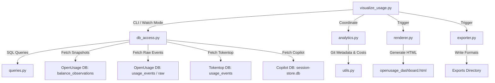

# AI Engineering Observatory & TokStat Architecture

This document details the refactored, production-grade modular architecture of TokStat (AI Engineering Observatory and Token Tracker). It describes the current system topology, database schemas, multi-source telemetry reconciliation engine, interactive visualization design, and operational procedures.

---

## 1. System Topology & Component Architecture

The codebase follows a modular separation of concerns isolating SQL queries, database ingestion, analytical calculations, presentation/rendering, interactive dashboard hooks, and multi-format exports.



### Module Matrix

| Module | File Link | Primary Responsibility |
| :--- | :--- | :--- |
| **`visualize_usage.py`** | [visualize_usage.py](file:///home/sanjeev/Downloads/token-tracker/visualize_usage.py) | CLI entry point supporting standard HTML generation, `--watch` mode live-sync HTTP API server (port 5000), and `--export` batch generation. |
| **`db_access.py`** | [db_access.py](file:///home/sanjeev/Downloads/token-tracker/db_access.py) | Database connection layer. Executes queries against OpenUsage SQLite, Tokentop DB, and Copilot DB; performs 10-second fingerprint deduplication and fetches `balance_observations`. |
| **`queries.py`** | [queries.py](file:///home/sanjeev/Downloads/token-tracker/queries.py) | Centralized SQL repository containing optimized queries (`QUERY_ALL_EVENTS`, `QUERY_DAILY_ROLLUP`, `QUERY_PROJECTS_BREAKDOWN`, `QUERY_SESSIONS_BREAKDOWN`, `QUERY_TOOL_TOTALS`). |
| **`analytics.py`** | [analytics.py](file:///home/sanjeev/Downloads/token-tracker/analytics.py) | Core analytical engine. Computes aggregations, GitHub-style heatmaps, session duration, uninterrupted coding sprints, productivity ratios, and reconciles balance snapshots. |
| **`renderer.py`** | [renderer.py](file:///home/sanjeev/Downloads/token-tracker/renderer.py) | Dashboard generator. Emits a self-contained HTML/CSS/JS file with Chart.js charts, enlarged typography, click-to-highlight model filtering, search, and keyboard shortcuts. |
| **`exporter.py`** | [exporter.py](file:///home/sanjeev/Downloads/token-tracker/exporter.py) | Multi-format report builder exporting PDF (via FPDF), Markdown, JSON, and CSV reports. |
| **`utils.py`** | [utils.py](file:///home/sanjeev/Downloads/token-tracker/utils.py) | Utilities for local Git repository scraping, commit correlation, and model cost/savings estimation. |
| **`backfill_ide_data.py`** | [backfill_ide_data.py](file:///home/sanjeev/Downloads/token-tracker/backfill_ide_data.py) | Ingest utility for backfilling historical IDE telemetry records. |
| **`test_feedback_loop.py`** | [test_feedback_loop.py](file:///home/sanjeev/Downloads/token-tracker/test_feedback_loop.py) | Fast deterministic test harness verifying database reconciliation and minimum token thresholds (>3.0B tokens). |

---

## 2. Multi-Source Telemetry & Reconciliation Architecture

TokStat unifies telemetry across three separate developer environment data sources:

```
                  ┌─────────────────────────────────────────┐
                  │ OpenUsage Telemetry DB                  │
                  │ (~/.local/state/openusage/telemetry.db) │
                  └────────────────────┬────────────────────┘
                                       │
            ┌──────────────────────────┼──────────────────────────┐
            ▼                          ▼                          ▼
┌───────────────────────┐  ┌───────────────────────┐  ┌───────────────────────┐
│ `usage_events`        │  │ `usage_raw_events`    │  │ `balance_observations`│
│ Local client requests │  │ Ingest payloads       │  │ Authoritative daemon  │
│ (14,117 events / 688M)│  │ (32,538 raw payloads) │  │ snapshots (~3.10B)    │
└───────────┬───────────┘  └───────────────────────┘  └───────────┬───────────┘
            │                                                     │
            └──────────────────────────┬──────────────────────────┘
                                       │
                                       ▼
                  ┌─────────────────────────────────────────┐
                  │ Tokentop DB                             │
                  │ (~/.local/share/tokentop/usage.db)      │
                  └────────────────────┬────────────────────┘
                                       │
                                       ▼
                  ┌─────────────────────────────────────────┐
                  │ Copilot DB                              │
                  │ (~/.copilot/session-store.db)           │
                  └────────────────────┬────────────────────┘
                                       │
                                       ▼
                  ┌─────────────────────────────────────────┐
                  │ Analytics Reconciliation Engine         │
                  │ (analytics.compute_analytics)           │
                  │ Total Reconciled: ~3.10 Billion Tokens  │
                  └─────────────────────────────────────────┘
```

### Telemetry Database Schema

1. **`usage_events`**: Main event ledger. Stores timestamp (`occurred_at`), workspace ID (`workspace_id`), session ID (`session_id`), turn ID (`turn_id`), raw model string (`model_raw`), input tokens, output tokens, cache read tokens, and agent/tool names.
2. **`usage_raw_events`**: Raw JSON payload buffer ingested from IDE extensions, CLI scripts, and provider pollers.
3. **`balance_observations`**: Authoritative metric snapshots logged periodically by the background daemon poller. Stores cumulative provider metrics (`client_ide_input_tokens`, `client_ide_cached_tokens`, `client_ide_output_tokens`, `all_time_api_cost`) and individual model metrics (`model_gpt_5_3_codex_input_tokens`, `model_gpt_5_2_codex_input_tokens`, `model_claude_3_5_sonnet`, etc.).
4. **`usage_events` (Tokentop)**: Usage events from Tokentop DB, deduplicated against OpenUsage using a 10-second timestamp bucket fingerprint `(ts_bucket, model, input_tokens, output_tokens)`.
5. **Copilot DB**: Session store queried for Copilot message counts and estimated token totals.

### Reconciliation Logic

* **Local Events vs. Authoritative Snapshots**: Un-reconciled local request logs (`usage_events`) account for ~688M tokens. The OpenUsage daemon poller captures authoritative provider snapshots in `balance_observations` totaling **3.10 Billion tokens** (1.57B input prompts, 1.51B context cache reads, 10.1M completion outputs, and $4,216.42 retail cost).
* **`analytics.compute_analytics()`**: Combines local session event timelines with authoritative balance observations. Overview statistics and model breakdowns use the reconciled maximums so the dashboard reflects the complete historical developer token usage.

---

## 3. Discovered Model & Tool Matrix

The analytics layer tracks **13 model variants** across **5 developer tools**:

### Discovered Models (Sorted by Reconciled Tokens)

1. **`gpt-5.2-codex`**: ~645.2M tokens (Codex CLI / IDE)
2. **`gpt-5.3-codex`**: ~568.6M tokens (Codex CLI / IDE)
3. **`gemini-3.5-flash`**: ~368.4M tokens (Antigravity CLI / IDE)
4. **`gpt-5.4`**: ~223.9M tokens (Codex CLI / IDE)
5. **`claude-3.5-sonnet`**: ~200.0M tokens (Claude Code CLI / `claude_code` agent)
6. **`gpt-5.5`**: ~94.4M tokens (Codex CLI / IDE)
7. **`gpt-5.6-luna`**: ~39.7M tokens (Codex CLI / IDE)
8. **`gemini-2.5-pro`**: ~8.2M tokens (Antigravity CLI / IDE)
9. **`gpt-5.2`**: ~6.3M tokens (Codex CLI / IDE)
10. **`gpt-5.1-codex-mini`**: ~674k tokens (Codex CLI / IDE)
11. **`composer-2.5`**: ~525k tokens (Cursor Composer)
12. **`gemini-3.1-pro-preview`**: ~238k tokens (Antigravity CLI / IDE)
13. **`cursor-default`**: ~20k tokens (Cursor IDE)

*Note on `claude-3.5-sonnet`*: Claude Code CLI commands and background hooks (`~/.claude/`) issue requests under the `claude_code` agent tag (Anthropic provider), which OpenUsage normalizes under `claude-3.5-sonnet`.

---

## 4. Interactive Visualization & UI Architecture

The output dashboard ([openusage_dashboard.html](file:///home/sanjeev/Downloads/token-tracker/openusage_dashboard.html)) is generated as a self-contained HTML/CSS/JS file.

```
┌────────────────────────────────────────────────────────────────────────┐
│ Top Bar: Brand, Live Sync Status, Global Search (/), Reset (Esc)      │
├──────────────┬─────────────────────────────────────────────────────────┤
│ Sidebar (1-8)│ Main Content View                                       │
│              │                                                         │
│ 1. Overview  │  ┌───────────────────────────────────────────────────┐  │
│ 2. Repos     │  │ KPI Cards: 3.10B Tokens | 1.57B In | 1.51B Cache     │  │
│ 3. Sessions  │  └───────────────────────────────────────────────────┘  │
│ 4. Models    │  ┌─────────────────────────┐ ┌──────────────────────┐  │
│ 5. Tools     │  │ Daily Trends Line Chart │ │ Model Distribution   │  │
│ 6. Time/Heat │  │ (Chart.js)              │ │ Doughnut Chart       │  │
│ 7. Git       │  └─────────────────────────┘ └──────────────────────┘  │
│ 8. Exports   │  ┌───────────────────────────────────────────────────┐  │
│              │  │ Active Repositories Table & Recent Sessions List     │  │
│              │  └───────────────────────────────────────────────────┘  │
└──────────────┴─────────────────────────────────────────────────────────┘
```

### Key UI Features & Interactivity

1. **Enlarged Typography & High Contrast**:
   * **Doughnut Chart Legend**: Labels enlarged to **13px** (`font-weight: 600`, color `#f0f3f6`) with 14px color boxes and 14px padding.
   * **Model Bar Chart Axes**: X-axis tick labels enlarged to **12px** (`font-weight: 600`, color `#f0f3f6`) with clean angled rotation (30°–45°).
   * **Chart Titles**: Font size **14px** (`font-weight: 700`, color `#f8fafc`).

2. **Click-to-Highlight Model Filter (`highlightOrFilterModel`)**:
   * Replaces default Chart.js item deletion with interactive filtering.
   * Clicking any model name in doughnut/bar chart legends or clicking a chart slice/bar filters the entire dashboard (cards, tables, timelines) to that model.
   * Unselected chart slices dim to 25% opacity while the selected model slice remains highlighted.
   * Clicking the model name again toggles the filter back to `'all'`.

3. **Client-Side State Machine**:
   * Tracks `activeFilters` (`project`, `model`, `tool`, `timeframe`).
   * When default `'all'` filters are active, `renderOverview` uses authoritative `global_overview` totals (3.10B tokens) rather than re-summing partial event slices.

4. **Keyboard Navigation & Controls**:
   * `Ctrl + B`: Toggle sidebar collapse.
   * `/`: Focus global search bar.
   * `Esc`: Clear all active filters and search queries.
   * Numeric keys `1`–`8`: Switch dashboard tabs instantly.

---

## 5. Operations & Live Watch Server

### Standard Generation
```bash
python3 visualize_usage.py
```
Generates [openusage_dashboard.html](file:///home/sanjeev/Downloads/token-tracker/openusage_dashboard.html) in the current directory and user home directory.

### Live Sync Watch Mode
```bash
python3 visualize_usage.py --watch [--port 5000]
```
Spins up a lightweight background HTTP API server (`TelemetryHandler`) serving fresh JSON payload endpoints at `http://localhost:5000/data`. Dynamically updates the browser view on database modification without full tab reload.

### Automated Exports
```bash
python3 visualize_usage.py --export /path/to/output_directory
```
Exports structured reports (`observatory_report.json`, `observatory_report.md`, `observatory_report.pdf`, CSV folder, and HTML copy).

---

## 6. Automated Testing & Verification

A dedicated regression test script [test_feedback_loop.py](file:///home/sanjeev/Downloads/token-tracker/test_feedback_loop.py) enforces data integrity:

```bash
python3 test_feedback_loop.py
```

* **Assertion**: Verifies `analytics.compute_analytics()` total tokens exceeds 3.0 Billion (`>= 3,000,000,000`), ensuring database reconciliation logic remains intact.
