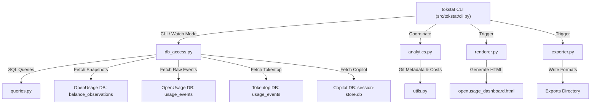

# TokStat - Architecture & Technical Reference

This document describes the modular architecture of **TokStat** (AI Engineering Telemetry Observatory & Token Tracker). It outlines the system topology, multi-source telemetry data pipelines, reconciliation logic, interactive visualization design, and CLI operations.

---

## 1. System Topology & Component Architecture

TokStat is designed with a modular architecture that enforces strict separation of concerns across database access, analytical computations, HTML dashboard rendering, multi-format exports, and CLI execution.



### Module Reference Matrix

| Module | Location | Primary Responsibility |
| :--- | :--- | :--- |
| **`cli.py`** | [`src/tokstat/cli.py`](../src/tokstat/cli.py) | Main CLI entry point (`tokstat`). Supports standard HTML dashboard generation, `--watch` mode live-sync HTTP API server, and `--export` multi-format batch generation. |
| **`db_access.py`** | [`src/tokstat/db_access.py`](../src/tokstat/db_access.py) | Database connection & ingestion layer. Connects to OpenUsage, Tokentop, and Copilot SQLite databases, performs time-bucket fingerprint deduplication, and reads provider balance snapshots. |
| **`queries.py`** | [`src/tokstat/queries.py`](../src/tokstat/queries.py) | Centralized repository of parameterized SQL queries (`QUERY_ALL_EVENTS`, `QUERY_DAILY_ROLLUP`, `QUERY_PROJECTS_BREAKDOWN`, `QUERY_SESSIONS_BREAKDOWN`, `QUERY_TOOL_TOTALS`). |
| **`analytics.py`** | [`src/tokstat/analytics.py`](../src/tokstat/analytics.py) | Core analytical engine. Computes metrics aggregations, GitHub-style heatmaps, session durations, uninterrupted coding sprints, productivity ratios, and multi-source balance reconciliation. |
| **`renderer.py`** | [`src/tokstat/renderer.py`](../src/tokstat/renderer.py) | Dashboard generator. Emits a self-contained, offline-capable HTML/CSS/JS file with Chart.js charts, interactive model highlighting, global search, and keyboard shortcuts. |
| **`exporter.py`** | [`src/tokstat/exporter.py`](../src/tokstat/exporter.py) | Multi-format export engine producing PDF (via FPDF2), Markdown, JSON, and CSV reports. |
| **`utils.py`** | [`src/tokstat/utils.py`](../src/tokstat/utils.py) | Utility functions for local Git repository commit scraping, usage-window commit correlation, and model cost/savings estimates. |
| **`backfill_ide_data.py`** | [`src/tokstat/backfill_ide_data.py`](../src/tokstat/backfill_ide_data.py) | Ingest utility for historical IDE telemetry records backfill. |

---

## 2. Multi-Source Telemetry & Reconciliation Architecture

TokStat aggregates telemetry events from multiple local developer environment databases:

```
┌─────────────────────────────────────────┐
│ OpenUsage Telemetry DB                  │
│ (~/.local/state/openusage/telemetry.db) │
└────────────────────┬────────────────────┘
                     │
          ┌──────────┴──────────┐
          ▼                     ▼
┌───────────────────┐ ┌────────────────────────┐  ┌──────────────────────────────────┐
│ `usage_events`    │ │ `balance_observations` │  │ Tokentop DB                      │
│ Granular requests │ │ Authoritative daemon   │  │ (~/.local/share/tokentop/...)    │
│ event timelines   │ │ provider snapshots     │  └────────────────┬─────────────────┘
└─────────┬─────────┘ └───────────┬────────────┘                   │
          │                       │                                │
          └───────────┬───────────┴────────────────────────────────┘
                      │
                      ▼
┌──────────────────────────────────────────┐
│ Copilot DB                               │
│ (~/.copilot/session-store.db)            │
└─────────────────────┬────────────────────┘
                      │
                      ▼
┌──────────────────────────────────────────┐
│ Analytics Reconciliation Engine          │
│ (`tokstat.analytics.compute_analytics`)  │
│ Total Reconciled Developer Token Economy │
└──────────────────────────────────────────┘
```

### Supported Data Sources

1. **OpenUsage DB (`telemetry.db`)**:
   - `usage_events`: Detailed request ledger tracking event timestamps (`occurred_at`), workspace IDs, session IDs, turn IDs, raw model strings, input/output/cache tokens, and tool names.
   - `usage_raw_events`: Raw JSON payload buffer from IDE extensions and CLI tools.
   - `balance_observations`: Periodically captured authoritative balance snapshots from background daemons logging cumulative provider usage metrics and per-model all-time totals.

2. **Tokentop DB (`usage.db`)**:
   - Evaluated and deduplicated against OpenUsage using a 10-second timestamp bucket fingerprint `(ts_bucket, model, input_tokens, output_tokens)`.

3. **Copilot Session Store (`session-store.db`)**:
   - Session store queried for Copilot message counts and token estimates.

### Reconciliation Strategy

- **Local Events vs. Authoritative Snapshots**: Granular local event logs provide rich session timelines, repo correlation, and turn-by-turn prompt analysis. Authoritative daemon snapshots in `balance_observations` provide total all-time provider token totals (including cache reads and cost estimations).
- **`analytics.compute_analytics()`**: Combines local event timelines with authoritative balance observations, ensuring dashboard top-level KPIs accurately reflect total usage while preserving detailed timeline breakdowns.

---

## 3. Discovered Model & Tool Matrix

TokStat normalizes raw model identifiers across AI CLI tools, IDE extensions, and API providers:

- **Codex & OpenAI Models**: `gpt-5.2-codex`, `gpt-5.3-codex`, `gpt-5.4`, `gpt-5.5`, `gpt-5.6-luna`, `gpt-5.1-codex-mini`, `gpt-5.2`.
- **Google Gemini Models**: `gemini-3.5-flash`, `gemini-2.5-pro`, `gemini-3.1-pro-preview`.
- **Anthropic Claude Models**: `claude-3.5-sonnet` (including Claude Code CLI requests issued under `claude_code`).
- **IDE Assistants**: `composer-2.5`, `cursor-default`.

---

## 4. Interactive Visualization & UI Architecture

The output dashboard (`openusage_dashboard.html`) is generated as a self-contained, single-file HTML application:

```
┌────────────────────────────────────────────────────────────────────────┐
│ Top Bar: Brand, Live Sync Status, Global Search (/), Reset (Esc)      │
├──────────────┬─────────────────────────────────────────────────────────┤
│ Sidebar      │ Main Content View                                       │
│              │                                                         │
│ 1. Overview  │  ┌───────────────────────────────────────────────────┐  │
│ 2. Repos     │  │ KPI Cards: Total Tokens | Input | Cache | Cost    │  │
│ 3. Sessions  │  └───────────────────────────────────────────────────┘  │
│ 4. Models    │  ┌─────────────────────────┐ ┌──────────────────────┐  │
│ 5. Tools     │  │ Daily Trends Line Chart │ │ Model Distribution   │  │
│ 6. Time/Heat │  │ (Chart.js)              │ │ Doughnut Chart       │  │
│ 7. Git       │  └─────────────────────────┘ └──────────────────────┘  │
│ 8. Exports   │  ┌───────────────────────────────────────────────────┐  │
│              │  │ Active Repositories Table & Recent Sessions List     │  │
│              │  └───────────────────────────────────────────────────┘  │
└──────────────┴─────────────────────────────────────────────────────────┘
```

### Key UI Features

- **Interactive Model Filtering (`highlightOrFilterModel`)**: Clicking any model legend entry or chart slice dynamically filters all cards, tables, and charts to that model. Unselected slices dim to 25% opacity.
- **Client-Side State Machine**: Manages filter dimensions (`project`, `model`, `tool`, `timeframe`) cleanly without full-page reloads.
- **Keyboard Shortcuts**:
  - `Ctrl + B`: Toggle sidebar collapse.
  - `/`: Focus global search input.
  - `Esc`: Clear all active filters and search terms.
  - Number keys `1`–`8`: Switch view tabs.

---

## 5. Operations & CLI Usage

### Standard Dashboard Generation
```bash
tokstat
```
Generates a self-contained HTML report (`openusage_dashboard.html`).

### Live Sync Watch Mode
```bash
tokstat --watch --port 5000
```
Launches a lightweight local API server (`TelemetryHandler`) serving live JSON updates at `http://localhost:5000/data`. Re-renders the dashboard automatically when `telemetry.db` changes.

### Automated Multi-Format Export
```bash
tokstat --export ./reports
```
Generates `observatory_report.json`, `observatory_report.md`, `observatory_report.pdf`, CSV datasets, and a copy of `observatory_dashboard.html` in `./reports`.

---

## 6. Testing & Quality Assurance

Unit and integration tests verify reconciliation logic, queries, and analytics calculation integrity:

```bash
# Run test suite
pytest

# Run code linter
ruff check .
```
